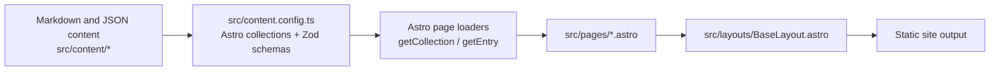
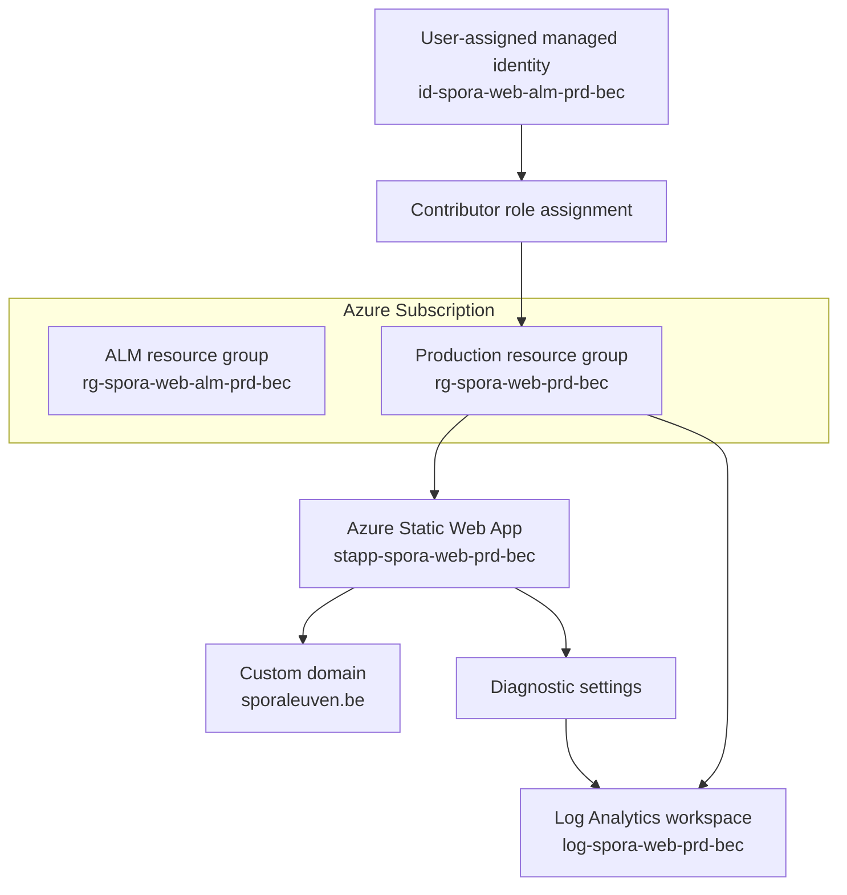
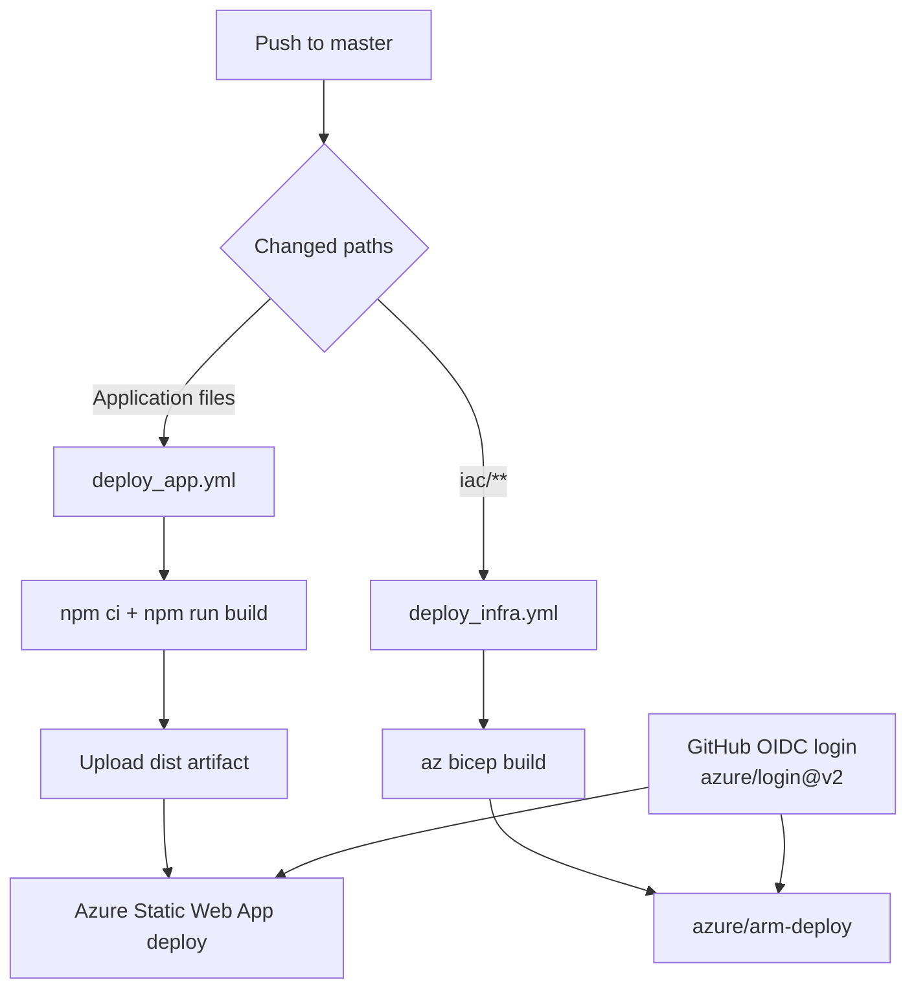
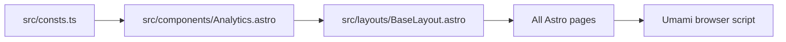

# Technical setup

This page consolidates the current technical implementation of the Spora Leuven website in a GitHub Wiki-friendly format.

## Astro CMS design

The site is implemented as a static Astro application with code-managed content collections. Instead of a separate back-office CMS, editors update Markdown and JSON files in `src/content`, while Astro validates the content shape in `src/content.config.ts` before building the site.

### Content model

| Collection | Source | Used by | Purpose |
| --- | --- | --- | --- |
| `news` | `src/content/news/*.md` | `src/pages/index.astro` | Homepage news cards |
| `teams` | `src/content/teams/*.md` | `src/pages/teams.astro`, `src/pages/calendar.astro` | Team metadata |
| `gyms` | `src/content/gyms/*.md` | `src/pages/contact.astro` | Sports hall details |
| `games` | `src/content/games/games.json` | `src/pages/calendar.astro` | Match calendar |

Each collection is defined with a Zod schema so required fields are checked during the Astro build.

### Rendering design

- `src/layouts/BaseLayout.astro` provides the shared HTML shell, navigation, footer, and analytics include.
- `src/pages/index.astro` sorts the `news` collection newest-first and renders homepage updates.
- `src/pages/teams.astro` renders cards from the `teams` collection.
- `src/pages/calendar.astro` combines `games` with `teams` via `getEntry()` so calendar rows show readable team names.
- `src/pages/contact.astro` renders contact information and sports hall data from the `gyms` collection.
- `src/pages/history.astro` currently uses an in-file photo array instead of a content collection.

This makes Astro the CMS engine: content lives in the repository, schemas define the allowed structure, and pages compile the validated content into a static site.

## Hosting infrastructure

Infrastructure is declared with Bicep in `iac/` and split into:

1. **Application lifecycle management (ALM)** resources in `iac/alm.bicep`
2. **Runtime hosting** resources in `iac/main.bicep`

### Runtime resources

| Resource | Defined in | Role |
| --- | --- | --- |
| Resource group `rg-spora-web-prd-bec` | deployment target | Production resource container |
| Static Web App `stapp-spora-web-prd-bec` | `iac/main.bicep` | Hosts the built Astro site |
| Custom domain `sporaleuven.be` | `iac/main.bicep` | Public website domain |
| Log Analytics workspace `log-spora-web-prd-bec` | `iac/main.bicep` | Stores diagnostics |
| Diagnostic settings on the Static Web App | `iac/main.bicep` | Sends logs and metrics to Log Analytics |

### ALM resources

| Resource | Defined in | Role |
| --- | --- | --- |
| Resource group `rg-spora-web-alm-prd-bec` | `iac/alm.bicep` via `iac/resourceGroup.bicep` | Isolates deployment support resources |
| User-assigned managed identity `id-spora-web-alm-prd-bec` | `iac/alm.bicep` | Identity for deployment automation |
| Contributor role assignment on `rg-spora-web-prd-bec` | `iac/alm.bicep` | Grants the managed identity deployment rights |

The current production hosting path is the Static Web App. Older App Service resources remain commented in `iac/main.bicep`, so they are design history rather than active infrastructure.

## Build and deploy automation

The repository uses two GitHub Actions workflows under `.github/workflows`.

### 1. Application build and deploy

`deploy_app.yml` runs on pushes to `master` except when only `iac/**` changed.

Build job:

1. checks out the repository
2. installs Node.js 22
3. runs `npm ci`
4. builds the Astro site with `npm run build`
5. uploads `dist`, `package.json`, and `package-lock.json` as the deployment artifact

Deploy job:

1. downloads the build artifact
2. authenticates to Azure with `azure/login@v2` using OIDC (`AZURE_TENANT_ID`, `AZURE_SUBSCRIPTION_ID`, `AZURE_CLIENT_ID`)
3. deploys the site to Azure Static Web Apps with `Azure/static-web-apps-deploy@v1`

### 2. Infrastructure build and deploy

`deploy_infra.yml` runs on pushes to `master` when files under `iac/**` changed.

Build job:

1. checks out the repository
2. validates the Bicep template with `az bicep build --file iac/main.bicep`

Deploy job:

1. checks out the repository
2. authenticates to Azure with `azure/login@v2` using OIDC
3. deploys `iac/main.bicep` to resource group `rg-spora-web-prd-bec` with `azure/arm-deploy@v2`

## User analytics with Umami

Visitor analytics are handled centrally:

- `src/layouts/BaseLayout.astro` mounts `src/components/Analytics.astro` once in the shared `<head>`
- `src/components/Analytics.astro` renders the Umami script tag
- `src/consts.ts` provides the tracking configuration

Current behavior:

- `UMAMI_WEBSITE_ID` is committed in `src/consts.ts`
- `UMAMI_SCRIPT_URL` defaults to `https://cloud.umami.is/script.js`
- `PUBLIC_UMAMI_SCRIPT_URL` can override the script URL at build time
- the deploy workflow also provides `PUBLIC_UMAMI_WEBSITE_ID`, but the current site code does not consume that value

Because the analytics component is included in the shared layout, every page request gets the same tracking snippet without repeating analytics code in individual pages.
